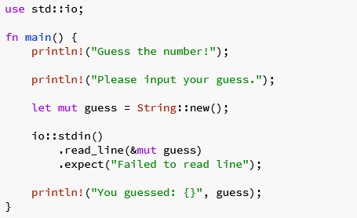
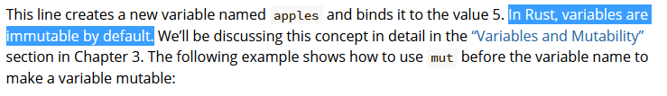
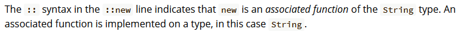
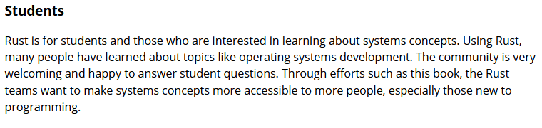
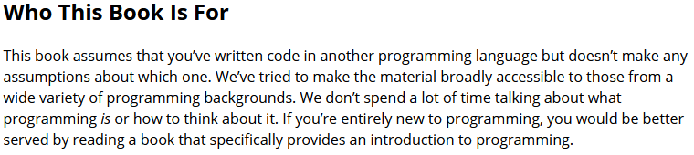

# Intro to intros

You know what I am tired of? Hello World

The number of languages I have written "Hello world" in dates back to basic in the 80s/90s. And while the landscape of technology has changed quite a bit since then, the entry point for our supposed learning as not.

Most instructional materials for languages are lacking for different audiences. This leads to things like:

- Rust is hard! (it isn't)
- Rust is easy! (it isn't)
- Go is developed by Google (whom we should all trust!) along with the big guns for those who developed C!
- Java solves everything! Wait - Kotlin will solve everything!
- Types? We don't need no stinking types! JavaScript is what built Web 2.0! Well, we now want to type things, so here is TypeScript!
- Python is crap for performance because of the GIL!
- Concurrency is hard - Why did we move to more cores and not have the language features to support it?
- Only $%{DEROGATORY_VARIABLE}%$ type persons use $%{JUDGMENT_VARIABLE}%$. There is only ONE TRUTH FOR ALL THINGS.

Variables include "real" men, programmers, $%{SUBVAR}%$ developers, using assembly, C/C++/C#/D/F#/erlang/julia/R/relevant whitespace/tabs for whitespace/four spaces for whitespace/semicolons/curly braces/inference/explicit syntax/sugar/salt/magic/patterns/anti-patterns/best practices/unsafe/SQL/NoSQL/Docker/WASM/Windows/Linux/Unix/Apple/LOUD NOISES!

... okay - maybe I am sick of more than just Hello World.

Am I here to be a whiny individual? Probably. Mostly I would like to get all that out of the way and talk about different ways humans learn things. I'm a firm believer in the Socratic Method for both teaching and learning. I have taught a number of different technical concepts to different folks over my years, and I can confidently say that each time I teach something, I become stronger in the subject I am teaching, as I get asked questions I have not thought about. Sometimes the questions can come off as "Organizational culture lay down on the riverbed?", and I then have an opportunity to __REALLY__ revisit what I know and what I think I know.

I'm hopeful to use some of this space here to highlight ideas and concepts and overall things I want to learn, so I am going to try to cram my understanding of things into a format that makes sense to me, and my nonexistent audience can correct me at some point.

Okay. Opening gambit over. Let us jump into a complex topic. Rust!

# Cultural Reference to grab attention on the opening paragraph
Of the many topics I rattled off before, I think Rust might be the one I really want to "talk" about. The advice given generally in learning Rust is "go read **The Book**".

**The Book** has a LOT of good information in it, and it is clear that it is trying to hit a certain audience. However, I have read **The Book** numerous times, and it gets to be a real slog at a certain point. It starts off as many (most) of the "YOU TOO CAN LEARN USING THIS" documents do. It demonstrates the pedigree, who is involved, why you (dear reader) are going to rule the world after completion, and some general reasons as to "Why".

Then installation, Hello World, package management, and then right into "Here is this code - it will do this. Do not worry about all the stuff we are about to explain away with some handwaving.
 Double colon? Psh - you should just know what those are and why.
 Semicolon? It is on some of the lines, but not others. Why?
 Parenthesis? Curly Braces? Bang? Just accept that these are things, and these things are needed. We'll get to explaining these (it doesn't)

 rant: the first jackwagon to use the term "Double Quote / Single Quote" instead of "Quotation Mark / Apostrophe" will be tossed into the drink. I have an equal amount of irritation when it comes to "Smart Quotes". On the Gripping Hand, the Grave Accent ` may be referred to as a backtick or backquote. 

I'm going to take this opportunity to try and break down what makes sense to me when it comes to what we have so far when it comes to structure.

I kept the formatting in there as an image, so we can all see some nice pretty formatting. In fairness, the text actually says "This code contains a lot of information, so let's go over it line by line."
These things are formatted in this way for a reason, so.... Why do we not have that explained here? Welcome to Chekhov's gun!

## Formatting and highlights

These Purple (#c670f1) things! Keywords! How do I know that? I had to search, and I found [Keywords!](https://doc.rust-lang.org/reference/keywords.html) - I'm hopeful that I can continue to be successful in associating what is assumed to be known by the readers. And the next color we see is....

Blue (#476af3) - Near as I can tell, this appears to be reserved for the name of the function itself. I am fully prepared to be wrong on this one, as I kept seeing it as main(), and only until we got to <b>3.3. Functions</b> do we see fn
another_function()

Red (#c8634d) looks like... Macros like `println!` as well as Structs (in `String::new();` the "String" part is a struct from std::string). And more!

- We soon see that integers are red as well (let apples = 5)
- Also, Data Types (u32, i32, char, f32), which leads us to
- numbers with decimals a.k.a Floating Points (3.0)
- Oh, and then the values of the bool data types, true and false
- AH! And later we see `#[derive(Debug)]` in **5.2. An Example Program Using Structs**

It seems that it is the intention of **The Book** to have us seeing a lot of red.

## Meanwhile, back at the farm

I hope now that we have some things more clearly defined (Explicit is better than Implicit, right?) we can get back to what we are looking at here.
**The Book** does a really good job of explaining the next few things. Really really. Prelude, entry point, and then onto a variable. It even lets us know that it will have a deeper dive into mutable/immutable variables in a later chapter.

Wait. *What?*

One of the core concepts of the language is brushed over in a single line:

This concept is SO IMPORTANT, and yet, it gets a single line, sans highlight. **wilhelm scream**

And then some examples of making a variable mutable/immutable. I'm confident that Chapter 3 will have information that we surely did not need before this point. Surely.
Now we see the description of what those darn double colon means - excellent!

Oh. Okay. Let us assume I have no knowledge of other programming languages. For the sake of argument, let us ignore this section in the Introduction Chapter:

In fairness, my 10YO daughter has done a LOT in Scratch. Like, an obscene amount, as she is an excited student. And now she is working her way to writing visual novels in RenPy. She is strong in understanding events, triggers, loops, logic, etc. Seems like those core items are what programming is, right? Would I recommend that once she has a good grasp of RenPy (and where it touches Python) that she move on to Rust?

Well, I would like to. I am not going to lie - as a programming language, Rust should be something that should be table stakes for our generations moving forward. One of the most often cited things I encounter when talking about Rust is that learning the concepts involved as core language features has enabled people to be better at writing in other languages (C++ jumps right to mind). So why is it that the official blessed document that everyone cites says "no no - do not start here. We want you to start somewhere else, and learn those bad habits before we come back to what we believe is the right way to do things."

And I think I have hit my major point here. This is the gap.

I would like Rust to be accessible to everyone. Why is it that by Chapter 2 of The Book, we have hit so much handwaving? I am not expecting Rust to be a perfect language, and I am not expecting their official documentation to be perfect either. What I am seeking here is a good means for that gap to be traversed.

Be CLEAR as to what is needed for humans to be successful in going through **The Book.**

*(I'm still going to continue working my way through the book, again, as I continue my thoughts in this irreverent critique style)*

Next update: TBD

